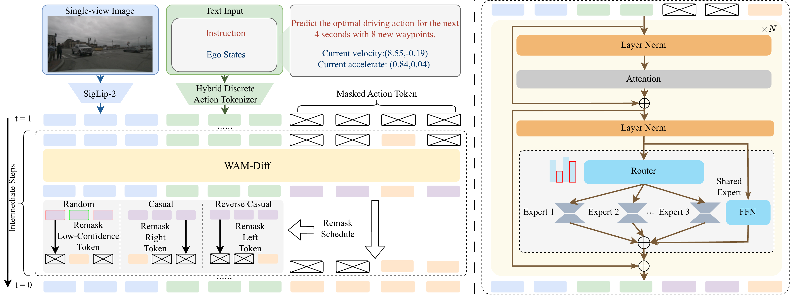

<h1 align='center'>WAM-Diff: A Masked Diffusion VLA Framework with MoE and Online Reinforcement Learning for Autonomous Driving</h1>
<div align='center'>
    <a href='https://github.com/xumingw' target='_blank'>Mingwang Xu</a><sup>1</sup>&emsp;
    <a href='https://cuijh26.github.io/' target='_blank'>Jiahao Cui</a><sup>1*</sup>&emsp;
    <a href='https://github.com/fudan-generative-vision/WAM-Flow' target='_blank'>Feipeng Cai</a><sup>2*</sup>&emsp;
    <a href='https://github.com/NinoNeumann' target='_blank'>Hanlin Shang</a><sup>1*</sup>&emsp;
    <a href='https://github.com/SSSSSSuger' target='_blank'>Zhihao Zhu</a><sup>1</sup>&emsp;
    <a href='https://github.com/isan089' target='_blank'>Shan Luan</a><sup>1</sup>&emsp;
</div>
<div align='center'>
    <a href='https://github.com/YoucanBaby' target='_blank'>Yifang Xu</a><sup>1*</sup>&emsp;
    <a href='https://github.com/fudan-generative-vision/WAM-Flow' target='_blank'>Neng Zhang</a><sup>2</sup>&emsp;
    <a href='https://github.com/fudan-generative-vision/WAM-Flow' target='_blank'>Yaoyi Li</a><sup>2</sup>&emsp;
    <a href='https://github.com/fudan-generative-vision/WAM-Flow‘ target='_blank'>Jia Cai</a><sup>2</sup>&emsp;
    <a href='https://sites.google.com/site/zhusiyucs/home' target='_blank'>Siyu Zhu</a><sup>1</sup>&emsp;
</div>

<div align='center'>
    <sup>1</sup>Fudan University&emsp; <sup>2</sup>Yinwang Intelligent Technology Co., Ltd&emsp;
</div>

## 🔧️ Framework


## 📅️ Roadmap

| Status | Milestone                                                                                             |    ETA     |
| :----: | :----------------------------------------------------------------------------------------------------: | :--------: |
|   🚀   | **[Releasing the inference source code](https://github.com/fudan-generative-vision/WAM-Diff)** | 2025.12.21        |
|   🚀   | **[Pretrained models on Huggingface](https://huggingface.co/fudan-generative-ai/WAM-Diff)**              | TBD        |
|   🚀   | **[Releasing the training scripts](#training)**                                                          | TBD        |


### Quick Inference Demo
The [WAM-Diff](TBD) is now available on Hugging Face Hub. To quickly test the model, follow these simple steps:

1. **Clone the repository**  
   ```bash
   git clone https://github.com/fudan-generative-vision/WAM-Diff
   cd WAM-Diff
   ```
2. **Initialize the environment**  
   Run the environment setup script to install necessary dependencies:
   ```bash
   bash init_env.sh
   ```
3. **Prepare the Model**
    Download the pretrained WAM-Diff model from Hugging Face to the `./model/WAM-Diff` directory:
    ```
    https://huggingface.co/fudan-generative-ai/WAM-Diff
    ```
    Download the pretrained Siglip2 model from Hugging Face to the `./model/siglip2-so400m-patch14-384` directory:
   ```
   https://huggingface.co/google/siglip2-so400m-patch14-384
   ```


3. **Run the demo script**  
   Execute the demo script to test WAM-Diff on an example image:
   ```bash
   bash ./train/inf.sh
   ```


## 🤗 Acknowledgements
We gratefully acknowledge the contributors to the [LLaDA-V](https://github.com/ML-GSAI/LLaDA-V), repositories, whose commitment to open source has provided us with their excellent codebases and pretrained models.