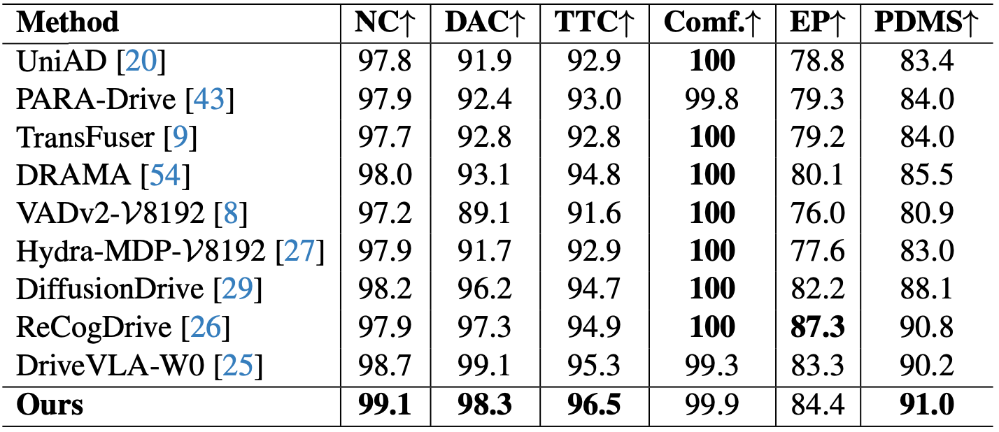
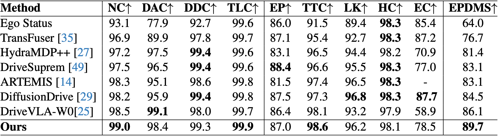

<h1 align='center'>WAM-Diff: A Masked Diffusion VLA Framework with MoE and Online Reinforcement Learning for Autonomous Driving</h1>
<div align='center'>
    <a href='https://github.com/xumingw' target='_blank'>Mingwang Xu</a><sup>1*</sup>&emsp;
    <a href='https://cuijh26.github.io/' target='_blank'>Jiahao Cui</a><sup>1*</sup>&emsp;
    <a href='https://github.com/fudan-generative-vision/WAM-Diff' target='_blank'>Feipeng Cai</a><sup>2*</sup>&emsp;
    <a href='https://github.com/NinoNeumann' target='_blank'>Hanlin Shang</a><sup>1*</sup>&emsp;
    <a href='https://github.com/SSSSSSuger' target='_blank'>Zhihao Zhu</a><sup>1</sup>&emsp;
    <a href='https://github.com/isan089' target='_blank'>Shan Luan</a><sup>1</sup>&emsp;
</div>
<div align='center'>
    <a href='https://github.com/YoucanBaby' target='_blank'>Yifang Xu</a><sup>1</sup>&emsp;
    <a href='https://github.com/fudan-generative-vision/WAM-Diff' target='_blank'>Neng Zhang</a><sup>2</sup>&emsp;
    <a href='https://github.com/fudan-generative-vision/WAM-Diff' target='_blank'>Yaoyi Li</a><sup>2</sup>&emsp;
    <a href='https://github.com/fudan-generative-vision/WAM-Diff' target='_blank'>Jia Cai</a><sup>2</sup>&emsp;
    <a href='https://sites.google.com/site/zhusiyucs/home' target='_blank'>Siyu Zhu</a><sup>1</sup>&emsp;
</div>

<div align='center'>
    <sup>1</sup>Fudan University&emsp; <sup>2</sup>Yinwang Intelligent Technology Co., Ltd&emsp;
</div>


## 📅️ Roadmap

| Status | Milestone                                                                                             |    ETA     |
| :----: | :----------------------------------------------------------------------------------------------------: | :--------: |
|   🚀   | **[Releasing the inference source code](https://github.com/fudan-generative-vision/WAM-Diff)** | 2025.12.21      |
|   🚀   | **[Releasing the training scripts](https://github.com/fudan-generative-vision/WAM-Diff)**                                                       | 2025.12.21      |
|   🚀   | **[Pretrained models on Huggingface](https://huggingface.co/fudan-generative-ai/WAM-Diff)**              | TBD        |


## 🔧️ Framework


## 🏆 Qualitative Results on NAVSIM
### NAVSIM-v1 benchmark results
<div style="text-align: center;">
  
</div>

### NAVSIM-v2 benchmark results
<div style="text-align: center;">

</div>


## Quick Inference Demo
The WAM-Diff will be available on Hugging Face Hub soon. To quickly test the model, follow these simple steps:

1. **Clone the repository**  
   ```bash
   git clone https://github.com/fudan-generative-vision/WAM-Diff
   cd WAM-Diff
   ```
2. **Initialize the environment**  
   If you prefer conda, run the environment setup script to install necessary dependencies:
   ```bash
   bash init_env.sh
   ```
   Or you can use uv to create the environment:
   ```bash
   uv venv && uv sync
   ```
3. **Prepare the Model**
    Download the pretrained WAM-Diff model from Hugging Face (pending release) to the `./model/WAM-Diff` directory:
    ```
    https://huggingface.co/fudan-generative-ai/WAM-Diff
    ```
    Download the pretrained Siglip2 model from Hugging Face to the `./model/siglip2-so400m-patch14-384` directory:
   ```
   https://huggingface.co/google/siglip2-so400m-patch14-384
   ```


3. **Run the demo script**  
   Execute the demo script to test WAM-Diff on an example image:
   ```bash
   bash inf.sh
   ```

## Training
To fine-tune WAM-Diff, please follow these steps:
1. **Set Up the Environment**  
   Follow the same environment setup steps as in the Quick Inference Demo section.
2. **Prepare the Data**  
Prepare your training dataset in JSON format like
    ```json
    [
        {
        "image": ["path/to/image1.png"],
        "conversations": [
            {
                "from": "human",
                "value": "Here is front views of a driving vehicle:\n<image>\nThe navigation information is: straight\nThe current position is (0.00,0.00)\nCurrent velocity is: (13.48,-0.29)  and current accelerate is: (0.19,0.05)\nPredict the optimal driving action for the next 4 seconds with 8 new waypoints."
            },
            {
                "from": "gpt",
                "value": "6.60,-0.01,13.12,-0.03,19.58,-0.04,25.95,-0.03,32.27,-0.03,38.56,-0.05,44.88,-0.06,51.16,-0.09"
            }
            ]
        },
        ...
    ]
    ```
3. **Run the Training Script**  
   Execute the training script with the following command:
   ```bash
   cd train
   bash ./scripts/llada_v_finetune.sh
   ```

## 📝 Citation

If you find our work useful for your research, please consider citing the paper:

```
@article{xu2025wam,
  title={WAM-Diff: A Masked Diffusion VLA Framework with MoE and Online Reinforcement Learning for Autonomous Driving},
  author={Xu, Mingwang and Cui, Jiahao and Cai, Feipeng and Shang, Hanlin and Zhu, Zhihao and Luan, Shan and Xu, Yifang and Zhang, Neng and Li, Yaoyi and Cai, Jia and others},
  journal={arXiv preprint arXiv:2512.11872},
  year={2025}
}
```

## 🤗 Acknowledgements
We gratefully acknowledge the contributors to the [LLaDA-V](https://github.com/ML-GSAI/LLaDA-V), repositories, whose commitment to open source has provided us with their excellent codebases and pretrained models.